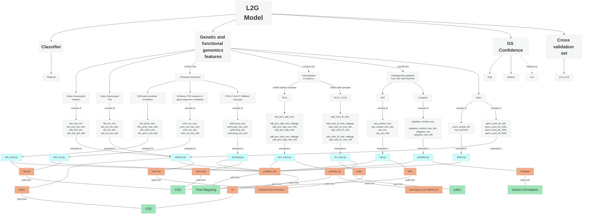

```mermaid
%%{init: {'theme': 'base', 'themeVariables': { 'primaryColor': '#f5f7f6'}}}%%
graph TD
A[<b><font size=8>L2G Model</b>] -->B(<b><font size=6>Classifier</b>) --> C[XGBoost]
A --> D[<b><font size=6>Genetic and functional <br> genomics features</b>]
D --> E[Naive closest gene <br> footprint]
D --> F[Naive closest gene <br> TSS]
D --> |LOGO/LOGI|H[Chromatin interaction]
D --> |LOGO/LOGI|I[Colocalization <br>of molQTLs]
D --> |LOGO/LOGI|J[Pathogenicity prediction <br> from VEP and PolyPhen]
A --> L[<b><font size=6>GS Confidence</b>]
L --> M[High]
L --> N[Medium]
L -.-> |Filtered out| O[Low]
A --> P[<b><font size=6>Cross validation set</b>]
P --> Q["[0,1,2,3,4]"]
E --> |consists of| GA[dist_foot_min,<br> dist_foot_min_nbh,<br> dist_foot_ave,<br> dist_foot_ave_nbh]
F --> |consists of| GAB[dist_tss_min,<br> dist_tss_min_nbh,<br> dist_tss_ave,<br> dist_tss_ave_nbh]
GA --> |extracted in| GB[distance.py]
GAB --> |extracted in| GB[distance.py]:::module
GB --- R[toploci]:::input
R --- |pulls from| AA[<font size=5>V2D]:::pipeline
GB --- S[credsets_v2d]:::input
S --- |pulls from| AD[<font size=5>Fine Mapping]:::pipeline
S --- |pulls from| AE[LD]:::input
AE --- AA
GB --- T[Gene set]:::input
T --- |pulls from| AB[Ensembl Gene Annotation]:::input
I --> |GWAS without sumstats| IA[PICS]
IA --> IB[eqtl_pics_clpp_max,<br> eqtl_pics_clpp_max_neglogp,<br> eqtl_pics_clpp_max_nhb,<br> pqtl_pics_clpp_max,<br> pqtl_pics_clpp_max_neglogp,<br> pqtl_pics_clpp_max_nhb]
IB --> |extracted in| IC[pics_coloc.py]:::module
IC --- S
IC --- U[credsets_qtl]:::input
U --- |pulls from| AD
U --- |pulls from| AF[phenotype_id_lut.190629.json]:::input
I --> |GWAS with sumstats| ID[GCTA- COJO]
ID --> IE[eqtl_coloc_llr_max,<br> eqtl_coloc_llr_max_neglogp,<br> eqtl_coloc_llr_max_nbh,<br> pqtl_coloc_llr_max,<br> pqtl_coloc_llr_max_neglogp,<br> pqtl_coloc_llr_max_nbh]
IE --> |extracted in| IF[fm_coloc.py]:::module
IF --- V[coloc]:::input
V --- |pulls from| AG[<font size=5>coloc]:::pipeline
V --- |pulls from| AB
IF --- U[credsets_qtl]:::input
H --> HA[DHS-gene promoter correlation]
H --> HB[Enhancer-TSS analysis of gene expression correlation]
H --> HC[PCHI-C from 27 different cell types]
HA --> HD[dhs_prmtr_max,<br> dhs_prmtr_max_nbh,<br> dhs_prmtr_ave,<br> dhs_prmtr_ave_nbh]
HD --> |extracted in| HE[dhs_prmtr.py]:::module
HE --- S
HE --- W[interval]:::input
W --- |pulls from| AC[<font size=5>V2G]:::pipeline 
HB --> |consists of| HF[enhc_tss_max,<br> enhc_tss_max_nbh,<br> enhc_tss_ave,<br> enhc_tss_ave_nbh]
HF --> |extracted in| HG[enhc_tss.py]:::module
HG --- S
HG --- W
HC --> |consists of| HH[pchicJung_max,<br> pchicJung_max_nbh,<br> pchicJung_ave,<br> pchicJung_ave_nbh]
HH --> |extracted in| HI[pchiJung.py]:::module
HI --- S
HI --- X[pchicJung]:::input
X --- |pulls from| AC[<font size=5>V2G]:::pipeline
J --> JA[VEP]
JA --> |consists of| JC[vep_credset_max,<br> vep_credset_max_nbh,<br> vep_ave,<br> vep_ave_nhb]
JC --> |extracted in| JD[vep.py]:::module
JD --- S
JD --- Y[VEP]:::input
Y --- |pulls from| AC[<font size=5>V2G]:::pipeline
J --> JB[Polyphen]
JB --> |consists of| JE[polyphen_credset_max,<br> polyphen_credset_max_nbh,<br> polyphen_ave,<br> polyphen_ave_nhb]
JE --> |extracted in| JF[polyphen.py]:::module
JF --- S
JF --- Z[Polyphen]:::input
Z --- |pulls from| AH[<font size=5>Variant Annotation]:::pipeline

D --> DA[Other]
DA --> |consists of| DB[count_credset_95,<br> has_sumstats]
DA --> |consists of| DC[gene_count_lte_50k,<br> gene_count_lte_100k,<br> gene_count_lte_250k,<br> gene_count_lte_500k]
DB --> |extracted in| DD[others.py]:::module
DC --> |extracted in| GB
DD --- S

classDef input fill:#F1AB86;
classDef module fill:#CCFBFE;
classDef pipeline fill:#9ee6ba;
classDef part fill:#84a7db;
```
